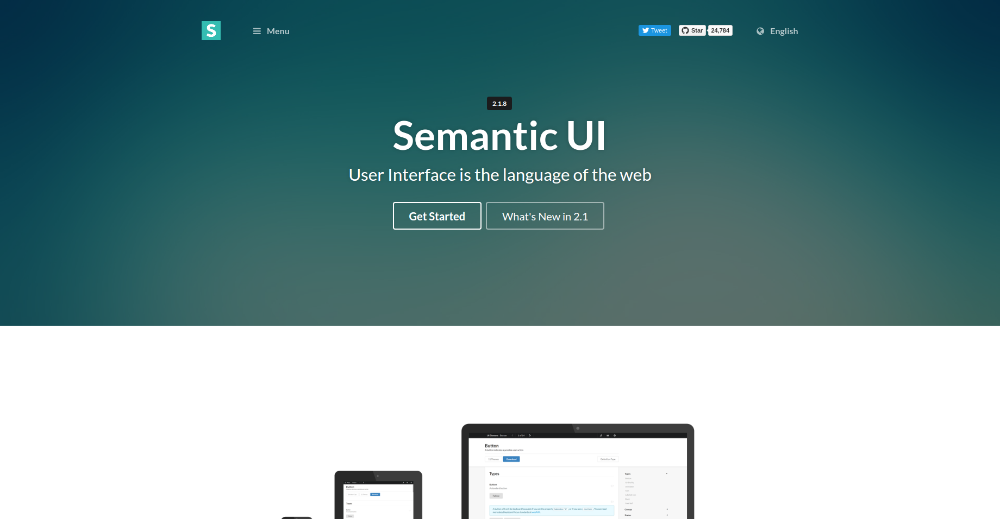
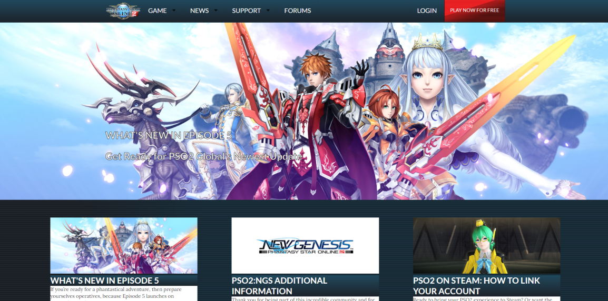

## Basic HTML and CSS

My very first experience in web design began with how most (or at least I believe most people) start with HTML and CSS. The first "website" I made was from my ICS 314 class and it looked very basic as I was still learning how to hobble together the pieces. I found it very enjoyable to learn how to make a basic website and continued to test out other things to make the website look better. After getting a grasp on the basics, I was shown an easier way to make an even better looking website.

## Semantic UI

Semantic UI was the next tool given to me in ICS 314 for web design. I found it a little more complicated, but due to its complexity I could make my websites look better. The main trouble I sometimes found myself with was remembering which 
 was in which 
. In a way I would relate writing all the 
's as matryoshka dolls. Even though it was hard at first, I began to understand it more and more. I found it a lot easier to make what I want, like making top bar menus which I find very enjoyable to create. I have an odd fascination with making pretty menu bars and Semantic UI makes it easy for me to make it how I envision it. Semantic UI even comes with built-in icons that I can use so that I'm not searching for one.

Using Semantic UI can be useful to making websites streamlined and I even used to to make a copy of a website. Although the website is not one for one in terms of how it looks, it still is pretty close in most aspects. The original website is called [Phantasy Star Online 2](https://pso2.com/) and it may look a little different now due to the website updating from when I created my remake, it still looks pretty close. I am really proud of being able to do this since I still am learning more techniques!

## Making It Look Good

In the end Semantic UI is a great tool in my opinion for people learning how to make basic+ websites. I find it not too complicated that it takes a genius level intellect, but not too simple that the websites come out bland or stale. I hope to get more ways to make websites look really pretty. Even though for coding I follow the "if it works it works" mentality usually, I feel my websites should look as best as they can because I want to be proud of something anyone can see. Having fun with making websites makes the process better and making it look good is a standard that everyone should aim for. Looking at other's people's websites I can see their techniques and try my best to see if I can implement them into my websites as well!
