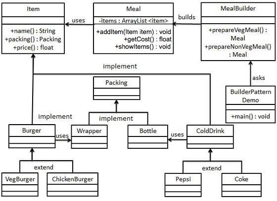

## Have Problems? Maybe It's Been Solved.

Design patterns at it simplist are solutions that can be applied to many situations which are helpful to solving problems. They are usually designed to be efficient and are basically the "cheat codes" to coding. Although you have the codes, you have to have some knowledge on how to use them. Design pattens can still help who are starting off by giving them a layout on how to approach it. Visualizing many of the design patterns can be seen using a flow chart similar to the picture above. You can see your inputs and desired outputs and what you might need to use to create the code you want. 

## Using the Power of Design Patterns

Unknowlingly, I have already been using design patterns before even learning what a design pattern is. This is mainly due to how coding has been brought up to date which incorperates many design patterns to make more design patterns. A good example of this is Meteor as itself has many design patterns that were modernized. I often for class use a template created by my professor called [(meteor-application-template)](https://ics-software-engineering.github.io/meteor-application-template-react/) to create my websites. The template itself could be considered a design pattern in the sense that it has a basic layout that I can freely manipulate to suit my needs. Then within the template I use Meteor which itself has a lot of the design patterns. One example is the Publish-Subscribe design pattern in Meteor. Simply put Publish-Subscribe can be used to view collections and restrict people who don't have access to certain collections.

## Good for Beginners, Great for Veterans

Due to the internet being the internet, information is spread out for everyone to see. Design patterns were created to make it easier for people to learn and apply their coding knowledge. For beginners, it allows them easier access to learning core information and getting hands on experience at harder problems. For veterans, it helps giving solutions to problems that may be faced when creating programs. For me, I find it very useful to have layouts and templates that I can use to start and also to be able to use in the future to prevent possible frustrations. Once you obtain the knowledge to starting coding, design patterns can make life easier since your problem may have been solved or it could give you a new direction to approaching your problem.
