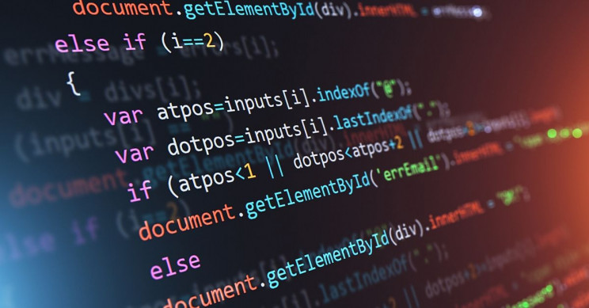

## Thinking About the End of 2020

With another year coming to an end, so too is this year of college. This fall semester has been an interesting time for me, with classes being online and not being able to follow my usual morning. Regardless this semester I have learned a lot about software engineering and other classes that I have taken. Concerning software engineering, I have learned in a couple months, the basics of creating a website, how to work in a group to design and create a project, standards that people use, new technical terms, and how to create a really nice portfolio for everyone to see. There are some major things I learned and I wish to share them with anyone here.

## Coding Standards

Now as simple as "coding standards" sounds, it is really good to have a definition of them. Everyone codes slightly differently from each other, but we all should follow basic coding standards so that we can help each other better. Not only does following coding standards make life easier for others who view your code, it makes it easier for yourself to see what you are doing as it is formatted in a clean way. If you want to hear more about my opinion on coding standards, please check out the essay Standards of Coding Standards!

## Agile Project Management

At some point during a person's life you will need to cooperate with other people to accomplish some goal. This concept is about working from what you want and making problems to create the project. Github was a great way for my group to manage our problems and as well as check up on the progress of what we still need to do. I used this concept particularly when designing my final group project. To learn more about that project please check out [Classtelations](https://jktang342.github.io/projects/class-project.html).

## Is this the End?

Of course this is not the end. It is merely just a chapter closing and opening the path to new experiences and learning opportunities. I am still and will always be learning more about software engineering. With that said, I really think that this fall semester was an experience that I won't be able to replicate (unless 2021 is another twist). I feel like that what I learned about software engineering is just the start and that foundation will lead me to creating what I envision in the end.

