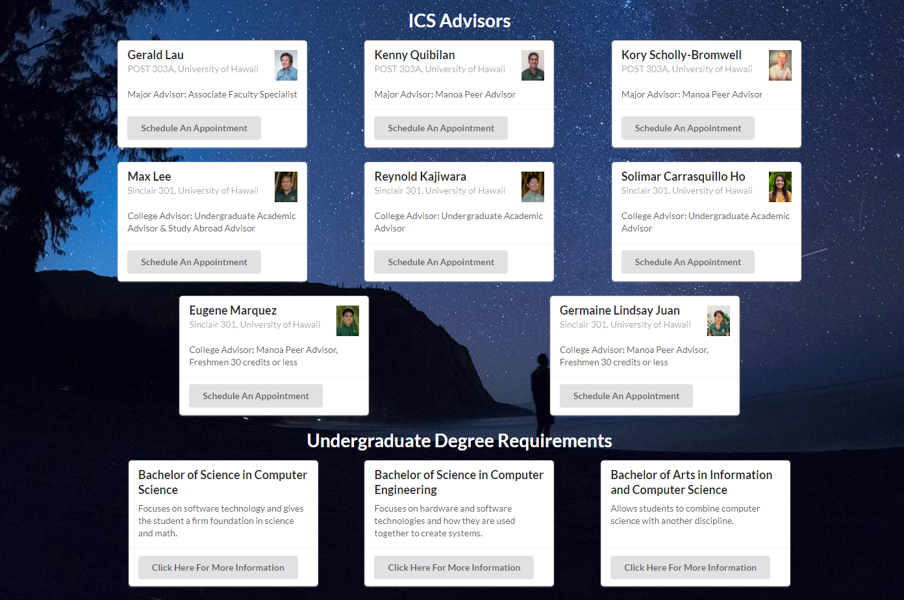

## What is "Classtellations"

Classtellations is a word combination of class and constellation since we themed our site to be star and space themed we also wanted a fun name to go with it. The goal of the website was to work along with STAR GPS (University of Hawaii's class sign up system) so that students would be able to see and plan out what they need to take the classes to obtain their degree. Basically you enter in the classes you have taken or plan on taking in the transcript page, then you can use the progress page to drag and drop your class into the ideal year. The website also provides arrows to show what you need to take certain classes (prerequisites) and will not let you put a class in a year that doesn't have the prerequisites obtained.

## My Contribution

My job mostly was the create the advisors page along with any resources that would be found on the page. To do this I created cards to hold the data and display something visually pleasing and easy to access. It shows the advisors and what their position is, where you can find them, and direct you to schedule and appointment. It took a while to get it to look how I wanted it to, but all that time was worth it as I believe that it looks nice. I also helped my team whenever they ran into some coding problems and we worked together to fix the problems.

## The End Product

While we hoped to create this website for all majors, there was just not enough time so we implemented for ICS majors. I still believe it came out well and I learned a lot about how to work together through Github on creating a website. I also learned some new coding techniques through working with others as everyone has their own unique way to approach a problem. If you have time please check out our [homepage](https://uh-classtellations.github.io/) and please if you do check out our homepage, go look at my wonderful teammate's works as well!
