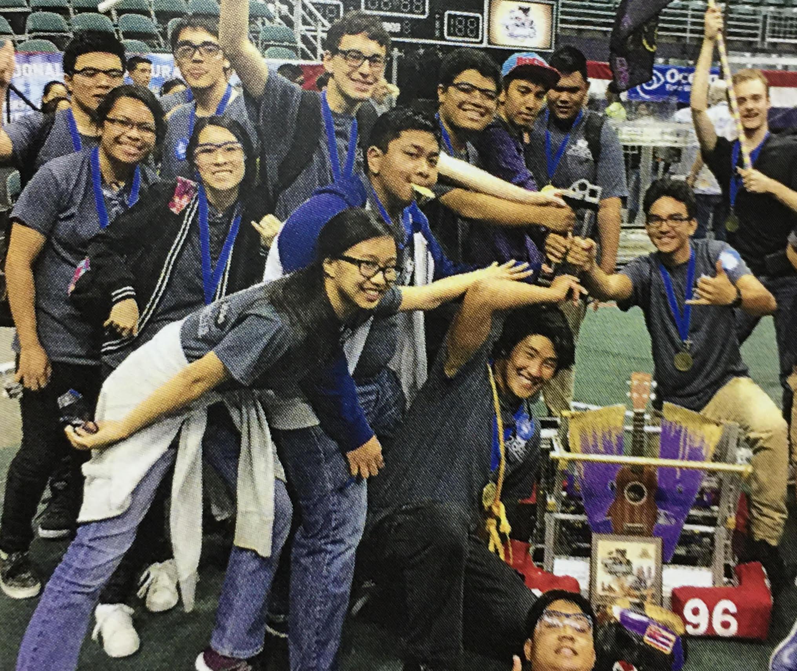

I joined robotics out of interest and also because I had friends in the club. I would help on making sure we had all the parts we needed to build our robot as well as managing the social media platforms. The 2017 robotics competition lasted from March 31st to April 1st and it was a lot of fun. The theme of the competition was steamworks, so there were different goals to accomplish. Some of these goals were grabbing gears and depositing them in the middle, shooting balls into the boilers for steam, and finally getting your robot to the airship before time was up. In the competition you also worked with two other groups, so a total of 3 robots, to get as many points as possible by finishing the stated goals. The first few days of the competition, each round you were randomly assigned two groups to work with. The top groups of these randomly assigned rounds would then go to on to the semi-final round and would be able to pick which groups they want on their team. 

## Designing a Robot and a Team

We had to decide out of the goals which should our robot focus on. My group decided we would focus on depositing gears and making the robot get to the airship. Although I didn't have much hands on work with the robot since I was handling with the social media platforms, I helped a lot with the testing and programming. It was a lot to try to make sure the robot would be able to deposit a gear on a hook. I made sure that everyone was doing their part and also tried to make team outings so that we wouldn't get burnt out creating the robot.

## The Results

Although we weren't the top scoring we were chosen by another group due to how effective our robot was at its job. It was very tense at the time, but I was happy to see the programs working as they should. When we won the competition everyone was ecstatic and proud of what we did. It was an experience that my group would never forget!

